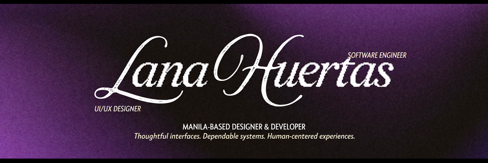

<div align="center">

<a href="https://portfolio-lanahuertas.vercel.app">
  
</a>

<a href="https://portfolio-lanahuertas.vercel.app">
  
</a>

<a href="https://portfolio-lanahuertas.vercel.app">
  
</a>
&nbsp;
<a href="mailto:lanadenisehuertas@gmail.com">
  
</a>

<br /><br />


</div>

## ✦ Portfolio first

My portfolio brings together selected **UI/UX work, product thinking, visual design, and frontend builds**—from early flows and prototypes to polished digital experiences.

### [portfolio-lanahuertas.vercel.app →](https://portfolio-lanahuertas.vercel.app)

## ✦ Pinned work

These are the projects currently pinned on my GitHub profile.

<table>
<tr>
<td width="50%" valign="top">

### [PsyClick](https://github.com/lanadenisehuertas/psyclick)

**Clinical psychomotor screening desktop app**

A Windows application that supports clinician-guided screening through real-time keystroke and mouse-dynamics analysis. I lead the four-person thesis team while working across backend development and UI/UX design.

`Python` `Electron` `Supabase` `Statistical Analysis`


<details>
<summary><b>What's under the hood →</b></summary>

<br />

- An **8-feature psychomotor extraction pipeline** — keystroke flight and dwell time, mouse velocity, jerk, and path entropy.
- A **Hotelling's T² multivariate anomaly detection engine**, compared against an EWMA-adaptive personal baseline.
- **Supabase** cloud storage running alongside a parallel offline-mode data layer.
- The Python backend packaged as a **standalone executable** for distribution.
- Directed a **4-person cross-functional team** through design, backend, and research workstreams to thesis defense.

</details>

</td>
<td width="50%" valign="top">

### [Bloom](https://github.com/lanadenisehuertas/bloom)

**Cycle-aware fitness and nutrition coach**

An iPhone-ready progressive web app that adapts workouts, nutrition, recovery, and progress tracking around the user's goals and menstrual cycle—all through a colorful, privacy-first experience.

`TypeScript` `React` `PWA` `IndexedDB` `UI/UX`


<details>
<summary><b>What's under the hood →</b></summary>

<br />

- A **real calendar-based cycle tracker** that learns actual cycle *and* period length from logged days, instead of assuming a textbook 28-day cycle.
- Workout intensity that **adapts to the detected phase** — easing during menstruation, encouraging progressive overload in the highest-capacity week.
- A nutrition engine with **live calorie logging**, a budget-conscious Filipino meal bank, and a grocery list generator.
- **100% offline and local** — IndexedDB via Dexie, no backend, no account, no data ever leaving the device.
- Behaviour design throughout: a "Minimum Viable Day" escape hatch, grace-day streaks, and automatic downshifts after a missed week.

</details>

[Explore the project →](https://github.com/lanadenisehuertas/bloom) · [Live app ↗](https://bloom-liart-delta.vercel.app)

</td>
</tr>
</table>

## ✦ Collaboration spotlight

### [⚔️ Algebrawl — Math Battle Arena](https://github.com/russellmagdaong/algebrawl)

An arcade-style educational game originally created with my college team in Java. Algebra practice becomes turn-based battles against Gauss, Newton, and Fibonacci; the project now also has a responsive React and TypeScript web edition.

`Java` `Game Design` `Mathematics` `Team Project` · [Play online →](https://algebrawl.vercel.app)

## ✦ A little about me

```yaml
name: Lana Denise Huertas
role: UI/UX Design Intern at Eden Holdings Philippines Inc.
education: BS Computer Science — Software Engineering
graduation: July 2027
recognition: Elite Scholar and DOST Scholar
focus:
  - human-centered product design
  - accessible, polished interfaces
  - dependable application backends
  - translating complex requirements into clear experiences
```

## ✦ Design + development toolkit

<div align="center">


</div>

| Design | Build | Lead |
|:--|:--|:--|
| Figma, Photoshop, Illustrator, Canva | Python, JavaScript/TypeScript, Kotlin fundamentals | Project planning and team coordination |
| Wireframes, user flows, prototypes | Electron, Next.js, React, REST APIs | Stakeholder translation and creative direction |
| Design systems, typography, accessible UI | Supabase, testing, offline-first data | Cross-functional delivery and thesis leadership |

## ✦ Milestones

- **IT Specialist: Python** — Certiport / Pearson VUE
- **PMI Project Management Ready** — Project Management Institute
- **Elite Scholar and DOST Scholar** — FEU Institute of Technology
- Former **Creatives Committee Head** — Student Coordinating Council and ACM Chapter

<details>
<summary><b>Where I've worked →</b></summary>

<br />

**UI/UX Design Intern** · Eden Holdings Philippines Inc. — Makati · *Aug 2026 – Present*
Wireframes, user flows, and interactive Figma prototypes for web and mobile. Maintains institutional design systems and UI component libraries alongside cross-functional development teams, and folds AI tooling into ideation and user research to move from stakeholder requirements to accessible, high-quality experiences faster.

**Freelance Graphic Designer & Video Editor** · Remote — Philippines · *2023 – Aug 2026*
Branded visual assets and marketing material for clients across several industries, with close attention to typography, hierarchy, and layout consistency.

**Creatives Committee Head** · Student Coordinating Council & ACM Chapter, FEU Tech · *Sep 2023 – Jul 2025*
Led creative teams and coordinated production timelines across two organisations for campus-wide events and interschool competitions.

</details>

<div align="center">

<br />

<picture>
  <source media="(prefers-color-scheme: dark)" srcset="https://raw.githubusercontent.com/lanadenisehuertas/lanadenisehuertas/output/github-contribution-grid-snake-dark.svg" />
  <source media="(prefers-color-scheme: light)" srcset="https://raw.githubusercontent.com/lanadenisehuertas/lanadenisehuertas/output/github-contribution-grid-snake.svg" />
  
</picture>

### Have a thoughtful product or design problem?

[Explore my portfolio](https://portfolio-lanahuertas.vercel.app) · [Browse my repositories](https://github.com/lanadenisehuertas?tab=repositories) · [Email me](mailto:lanadenisehuertas@gmail.com)

<br />



</div>
