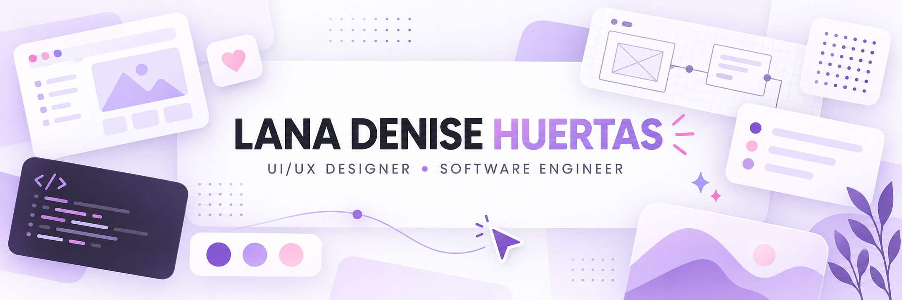

<div align="center">

<a href="https://portfolio-lanahuertas.vercel.app">
  
</a>

<br />

### I design thoughtful interfaces and build the systems behind them.

Manila, Philippines · UI/UX Design Intern · Computer Science student

<br />

<a href="https://portfolio-lanahuertas.vercel.app">
  
</a>
&nbsp;
<a href="mailto:lanadenisehuertas@gmail.com">
  
</a>

</div>

## ✦ Portfolio first

My portfolio brings together selected **UI/UX work, product thinking, visual design, and frontend builds**—from early flows and prototypes to polished digital experiences.

### [portfolio-lanahuertas.vercel.app →](https://portfolio-lanahuertas.vercel.app)

## ✦ Pinned work

These are the projects currently pinned on my GitHub profile.

<table>
<tr>
<td width="50%" valign="top">

### [PsyClick](https://github.com/lanadenisehuertas/psyclick)

**Clinical psychomotor screening desktop app**

A Windows application that supports clinician-guided screening through real-time keystroke and mouse-dynamics analysis. I lead the four-person thesis team while working across backend development and UI/UX design.

`Python` `Electron` `Supabase` `Statistical Analysis`

</td>
<td width="50%" valign="top">

### [PsyClick Product Site](https://github.com/lanadenisehuertas/psyclick-app)

**Public-facing product experience**

A responsive product website designed to make PsyClick's purpose, workflows, and research context easier to understand through a clear visual narrative.

`TypeScript` `React` `UI/UX` `Responsive Design`

[Visit the live site →](https://psyclick-app.vercel.app)

</td>
</tr>
</table>

## ✦ Collaboration spotlight

### [⚔️ Algebrawl — Math Battle Arena](https://github.com/russellmagdaong/algebrawl)

An arcade-style educational game originally created with my college team in Java. Algebra practice becomes turn-based battles against Gauss, Newton, and Fibonacci; the project now also has a responsive React and TypeScript web edition.

`Java` `Game Design` `Mathematics` `Team Project` · [Play online →](https://algebrawl.vercel.app)

## ✦ A little about me

```yaml
name: Lana Denise Huertas
role: UI/UX Design Intern at Eden Holdings Philippines Inc.
education: BS Computer Science — Software Engineering
graduation: July 2027
recognition: Elite Scholar and DOST Scholar
focus:
  - human-centered product design
  - accessible, polished interfaces
  - dependable application backends
  - translating complex requirements into clear experiences
```

## ✦ Design + development toolkit

<div align="center">


</div>

| Design | Build | Lead |
|:--|:--|:--|
| Figma, Photoshop, Illustrator, Canva | Python, JavaScript/TypeScript, Kotlin fundamentals | Project planning and team coordination |
| Wireframes, user flows, prototypes | Electron, Next.js, React, REST APIs | Stakeholder translation and creative direction |
| Design systems, typography, accessible UI | Supabase, testing, offline-first data | Cross-functional delivery and thesis leadership |

## ✦ Milestones

- **IT Specialist: Python** — Certiport / Pearson VUE
- **PMI Project Management Ready** — Project Management Institute
- **Elite Scholar and DOST Scholar** — FEU Institute of Technology
- Former **Creatives Committee Head** — Student Coordinating Council and ACM Chapter

<div align="center">

<picture>
  <source media="(prefers-color-scheme: dark)" srcset="https://raw.githubusercontent.com/lanadenisehuertas/lanadenisehuertas/output/github-contribution-grid-snake-dark.svg" />
  <source media="(prefers-color-scheme: light)" srcset="https://raw.githubusercontent.com/lanadenisehuertas/lanadenisehuertas/output/github-contribution-grid-snake.svg" />
  
</picture>

### Have a thoughtful product or design problem?

[Explore my portfolio](https://portfolio-lanahuertas.vercel.app) · [Browse my repositories](https://github.com/lanadenisehuertas?tab=repositories) · [Email me](mailto:lanadenisehuertas@gmail.com)

</div>
